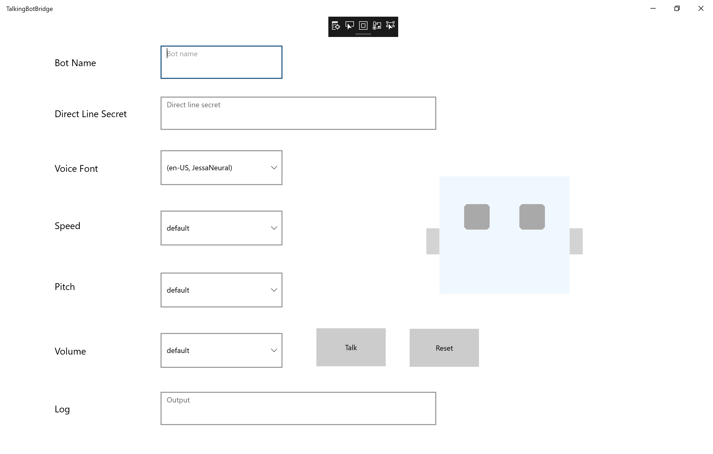
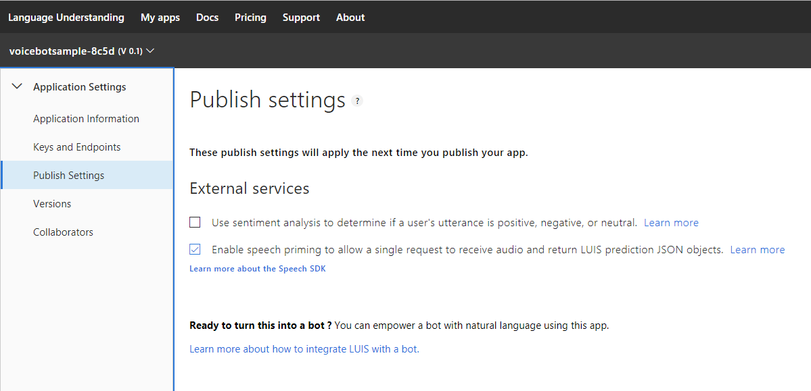
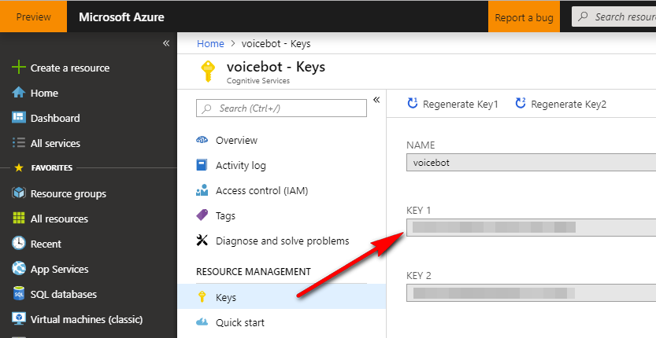

# Talking Bots for Azure Bot Service - get you're bot talking!

Let's face it, making computers talk is always great fun.  So bringing your existing bot to life with voice capability is absolutely necessary if you want to impress your friends/colleagues or manager! 
This bridge will enable speech input *and* output, so you can leave the keyboard behind :)  However, not only will this perform speech to text (STT) and text to speech (TTS) this will also perform natural language processing for you!

## Pre-reqs
Don't worry, if you don't have an existing bot, follow the instructions below to get started.  You will need:

- Azure Service bot with direct line enabled
- LUIS subscription, API key and published model
- Cognitive Speech subscription and API key

## UWP Desktop Bridge



This is where you can configure your bot, you'll need to grab the `directline` secret from the [Azure Portal](https://portal.azure.com) and paste it here.  Add your bot name (bot handle) as configured in the Azure Bot Service - this is required so that we can determine which messages are from the user and which are from the bot.
Then you'll need to select which [voice font](https://docs.microsoft.com/en-us/azure/cognitive-services/speech-service/language-support#text-to-speech) to use - here you'll see a range of male/female voices, including our latest neural network trained ones which sound very life-like.  If you want to take this a step further and use your own [Custom Speech voice font](https://westus.cris.ai/Home/CustomSpeech)- simply tweak the code behind for the your own voice font name and endpoint.

## Provision a Sample Bot
If you don't already have one, the quickest way is to deploy the `Basic Bot` template inside the [Azure Portal](https://portal.azure.com) - this will provision:
- Azure Service Bot
- Luis model wired up with configuration

Once you have this, download the bot source code from the [Azure Portal](https://portal.azure.com) and following the [Modifying your bot section](#Modifying-your-bot).

## Speech Intent Recognition
Here we are using a pretty awesome feature inside the Speech SDK which allows you to do LUIS intent recognition directly from the LUIS service - meaning that not only will it convert the speech input to text, it will also provide the LUIS recognition - returning a json object.  We don't do anything inside this desktop bridge with the LUIS result, we simply pass it onto the bot, so that the bot in turn doesn't need to perform additional LUIS calls to resolve the intent of the user's request - which is a considerable performance benefit.  
To pass the LUIS response to the bot, we use the `Activity.Value` eg:

#### TalkingBotBridge Extract:

```csharp
private async Task SendMessageToBot(string messageText, string luisIntent, object luisJson, string activityType)
{
    Activity message = new Activity
    {
        Text = messageText,
        Value = luisJson,
        Type = activityType.ToString(),
        From = new ChannelAccount(BotUser)
    };

    await directLineClient.Conversations.PostActivityAsync(botConversation.ConversationId, message);
}
```

## Modifying your bot

We're going to make a minor modification to the bot logic so that it doesn't always run LUIS for every call.  Since, if we are coming in via voice then we would already have run the LUIS Intent Recognition.  The [code above](#TalkingBotBridge-Extract) shows you how to pass data through directline and onto the bot, as we're dealing with Json, let's make life a little easier for ourselves my creating a c# backing class we can use for the deserialisation later.

#### LUIS Json Response:

``` csharp
public class LuisJson
{
	public string Query { get; set; }

	public Topscoringintent TopScoringIntent { get; set; }

	public JObject[] Entities { get; set; }

	public class Topscoringintent
	{
		public string Intent { get; set; }

		public float Score { get; set; }
	}
}
```

Now, we'll use this class to extract the LUIS data we're interested in within the bot.  The Speech SDK LanguageUnderstandingServiceResponse_JsonResult result is slightly different from the LuisRecognizer LUIS response.  We just want the top intent and the entities that LUIS determined for us.  

Bot Extract:

``` csharp
if (activity.Type == ActivityTypes.Message)
{
	string topIntent;
	JObject luisEntities;
	if (activity.Value != null)
	{
		var luisResponse = JsonConvert.DeserializeObject<LuisJson>(activity.Value.ToString());
		topIntent = luisResponse.TopScoringIntent.Intent;

		// Map SpeechRecognizer LanguageUnderstandingServiceResponse_JsonResult) LUIS response to LuisRecognizer
		luisEntities = new JObject();
		foreach (var item in luisResponse.Entities)
		{
			var p = new JProperty(item["type"].ToString(), new object[] { item["entity"].ToString() });
			luisEntities.Add(p);
		}
	}
	else
	{
		// Perform a call to LUIS to retrieve results for the current activity message.
		var luisResult = await _services.LuisServices[LuisConfiguration].RecognizeAsync(dc.Context, cancellationToken);
		var topScoringIntent = luisResult?.GetTopScoringIntent();
		topIntent = topScoringIntent.Value.intent;

		luisEntities = luisResult.Entities;
	}

// update greeting state with any entities captured
await UpdateGreetingState(luisEntities, dc.Context);
```
      
We then change the signature of hte UpdateGreetingState to accept the JObject of the luisEntities only, rather than the complete RecognizerResult, which we don't need anymore. 

```csharp
private async Task UpdateGreetingState(JObject luisEntities, ITurnContext turnContext)
{
	if (luisEntities != null && luisEntities.HasValues)
	{
		// Get latest GreetingState
		var greetingState = await _greetingStateAccessor.GetAsync(turnContext, () => new GreetingState());

		// Supported LUIS Entities
		string[] userNameEntities = { "userName", "userName_patternAny" };
		string[] userLocationEntities = { "userLocation", "userLocation_patternAny" };

		// Update any entities
		// Note: Consider a confirm dialog, instead of just updating.
		foreach (var name in userNameEntities)
		{
			// Check if we found valid slot values in entities returned from LUIS.
			if (luisEntities[name] != null)
			{
				// Capitalize and set new user name.
				var newName = (string)luisEntities[name][0];
				greetingState.Name = char.ToUpper(newName[0]) + newName.Substring(1);
				break;
			}
		}

		foreach (var city in userLocationEntities)
		{
			if (luisEntities[city] != null)
			{
				// Capitalize and set new city.
				var newCity = (string)luisEntities[city][0];
				greetingState.City = char.ToUpper(newCity[0]) + newCity.Substring(1);
				break;
			}
		}

		// Set the new values into state.
		await _greetingStateAccessor.SetAsync(turnContext, greetingState);
	}
}
```
Once you've made these tweaks, you'll have a bot that can either handle LUIS recognition already done via speech or more regulary, handle the LUIS API service calls itself for text based channels - ensuring that it's only ever performed once for the initial request.

# Cognitive Services
We're going to be using a combination of the following cognitive services:

- LUIS for natural language understanding
- Speech for speech to text and text to speech

## LUIS
Luis allows [Speech Priming](https://docs.microsoft.com/en-us/azure/bot-service/bot-service-manage-speech-priming?view=azure-bot-service-3.0), this is a feature we're going to enable and leverage.  




Note, if you're using a starter_key this won't work.  Go and create a LUIS resource in the [Azure Portal](https://portal.azure.com) and assign this to your LUIS model.

## Speech API
To leverage the [Speech API](https://azure.microsoft.com/en-gb/try/cognitive-services/?api=speech-services) you'll need a key.  Once you've provisioned this in Azure, get the API Key (not Subscription Key). 




Programmatically we'll generate an access token for the Speech API.  To do this we'll need the token endpoint of the API, this will depend on the region you've selected above.  

|   Region   |	Token service endpoint  |
| ----------------  | --------------------------------------------------------------------- |
| West US			| https://westus.api.cognitive.microsoft.com/sts/v1.0/issueToken |
| West US2			| https://westus2.api.cognitive.microsoft.com/sts/v1.0/issueToken
| East US			| https://eastus.api.cognitive.microsoft.com/sts/v1.0/issueToken
| East US2			| https://eastus2.api.cognitive.microsoft.com/sts/v1.0/issueToken
| East Asia			| https://eastasia.api.cognitive.microsoft.com/sts/v1.0/issueToken
| South East Asia	| https://southeastasia.api.cognitive.microsoft.com/sts/v1.0/issueToken
| North Europe		| https://northeurope.api.cognitive.microsoft.com/sts/v1.0/issueToken
| West Europe		| https://westeurope.api.cognitive.microsoft.com/sts/v1.0/issueToken


[Full list of speech token endpoints](https://docs.microsoft.com/en-us/azure/cognitive-services/speech-service/rest-apis)

You'll then need the text to speech endpoint, again this will depend on the region you're using.  We want to use the very latest neural voices, so will choose from one of the following:

|   Region   |	Endpoint  |
| ----------------  | --------------------------------------------------------------------- |
| East US			| https://eastus.tts.speech.microsoft.com/cognitiveservices/v1
| Southeast Asia	| https://southeastasia.tts.speech.microsoft.com/cognitiveservices/v1
| West Europe		| https://westeurope.tts.speech.microsoft.com/cognitiveservices/v1


[Full list of text to speech endpoints](https://docs.microsoft.com/en-us/azure/cognitive-services/speech-service/regions#text-to-speech)

Once you have the LUIS API key and model ID, together with the Speech API key and endpoints above, set these in the UWP app eg:

```csharp
private const string STTLanguage = "en-US";
private const string LuisSubscriptionKey = "<YOUR_LUIS_API_KEY>";
private const string LuisRegion = "westeurope";
private const string LuisAppID = "<YOUR_LUIS_APPID>";

private const string TTSSubscriptionKey = "<YOUR_SPEECH_API_KEY>";
private readonly Uri TTSAPIUri = new Uri("https://<YOUR_REGION>.tts.speech.microsoft.com/cognitiveservices/v1");
```

Either add your `directline` secret at design/run time, run the app and start talking to your bot!

# Troubleshooting
Since we're using a few different services here, it's easy for things to go wrong and you're scratching your head trying to work out why.  So here's a few items to check:

- LUIS is not using the Starter_Key, get a subscription key from the Azure Portal and publish the model using it.
- LUIS model and key are deployed in the data center you are expecting
- Speech subscription key matches the endpoint you are expecting
- The Bot id and Direct Line secret are correct
- The bot responds with text or speech attribute set, this bridge doesn't currently handle cards - but could be easily adapted.